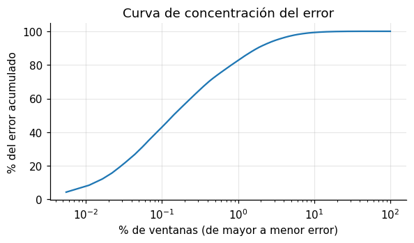
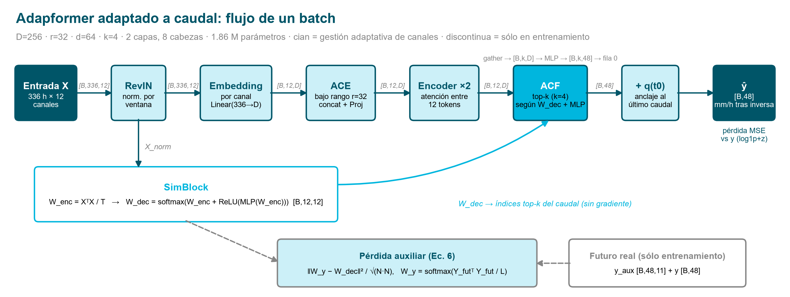
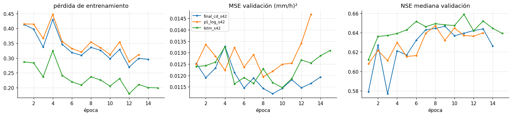
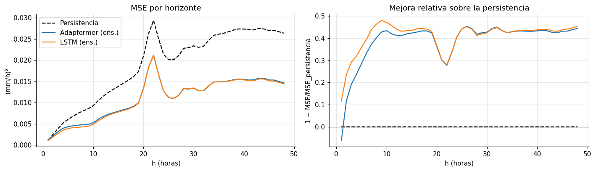
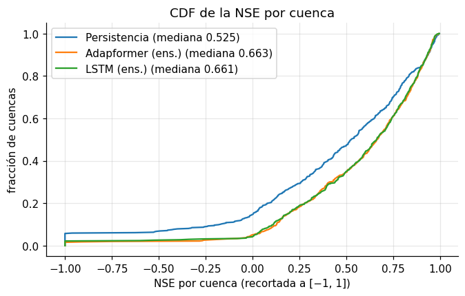
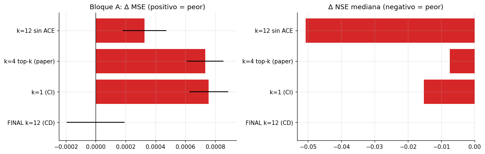
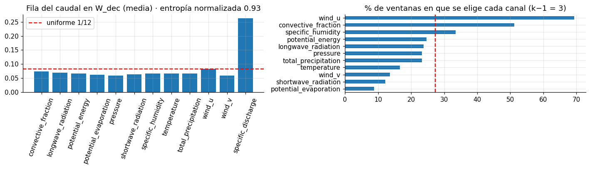
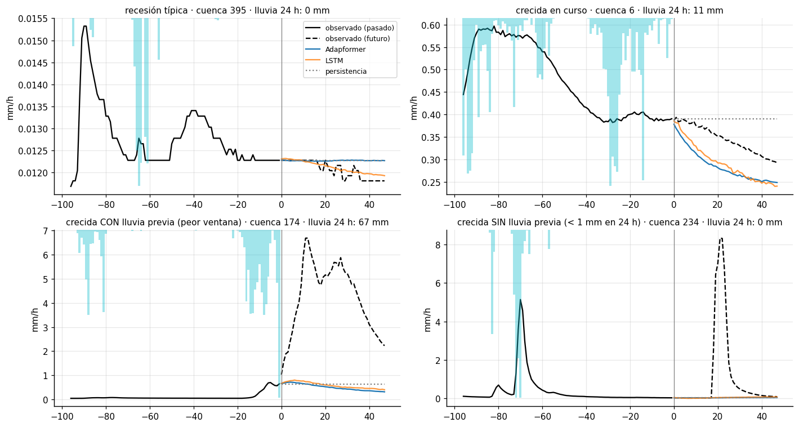
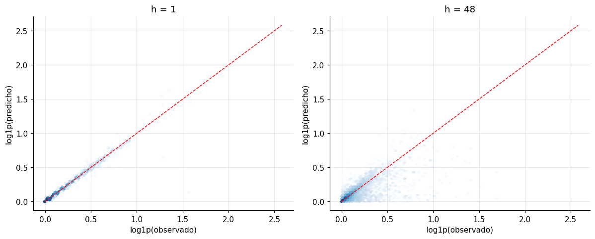

# Laboratorio 2 — Pronóstico de caudal con Adapformer

**Paper implementado:** Luo, Li, Peng & Gong. *Adapformer: Adaptive channel management for multivariate time series
forecasting.* Neural Networks 193 (2026) 107988.

**Tarea:** pronosticar el caudal específico (mm/h) de las próximas 48 h a partir de 336 h de 12 variables horarias de
una cuenca.

> **Resumen.** Implementamos Adapformer desde cero en PyTorch: RevIN, embedding invertido, ACE, encoder Transformer,
> SimBlock, ACF y la pérdida auxiliar de la Ec. 6. Lo adaptamos a un único objetivo, el caudal. El modelo entregado es
> un **ensamble de 3 semillas de Adapformer con k = 12**, elegido con validación. En validación obtiene
> **MSE 0.01117** (persistencia 0.01901, −41 %) y NSE mediana por cuenca 0.663. En test obtiene **MSE 0.01086**
> (persistencia 0.01411, −23 %). El modelo base LSTM, entrenado con las mismas mejoras, queda prácticamente empatado
> (val 0.01101, test 0.01091). En la ablación, **ACE es el componente con efecto más claro**; la selección adaptativa
> de canales (top-k) no ayuda con solo 12 variables y un único objetivo.

---

## 1. Datos y análisis exploratorio

| Elemento | Valor |
|---|---|
| `X` | [n, 336, 12]: 11 variables meteorológicas y el caudal observado (canal 11) |
| `y` | [n, 48]: caudal futuro en mm/h |
| `y_aux` | [n, 48, 11]: meteorología futura; **solo supervisión auxiliar**, nunca entrada |
| Train / validación / test | 254 000 / 18 142 / 27 983 ventanas (campo `split` dado) |
| Cuencas | 508, presentes en los tres conjuntos |

Hallazgos que guiaron el diseño (notebook `01_datos_y_eda`):

1. **Sin valores faltantes.** No se imputó nada; queda un `nan_to_num` defensivo.
2. **Colas pesadas.** Caudal y precipitación tienen asimetría ≈ 11–12, así que se aplica `log1p` antes del z-score.
3. **Persistencia muy fuerte a corto plazo.** La correlación del último caudal con el de t + 1 h es 0.98, y con el de
   t + 48 h, ≈ 0.6.
4. **El error se concentra en las crecidas.** El 10 % de ventanas con mayor caudal futuro aporta el **98.7 %** del MSE
   de la persistencia.
5. **El caudal se correlaciona poco con las demás variables** (|r| ≈ 0.1), y la lluvia lo afecta con un retraso de
   10–15 h.



## 2. El método: Adapformer

Los modelos *channel-independent* (CI) predicen cada variable solo con su propia historia: son robustos, pero ignoran
las relaciones entre variables. Los *channel-dependent* (CD) mezclan todas las variables: tienen más capacidad, pero
se contaminan con las irrelevantes. Adapformer mantiene el encoder Transformer estándar y gestiona los canales en el
embedding y en la decodificación:

```
X_norm = RevIN(X);  X_emb = Embedding(X_normᵀ);  X⁰ = ACE(X_emb);  Xᴶ = Encoderᴶ(X⁰);  Ŷ = ACF(Xᴶ, SimBlock(X_norm))
```

- **Embedding invertido.** Cada variable completa (336 h) es un token, como en iTransformer; la atención opera entre
  variables.
- **ACE (Adaptive Channel Enhancer).** Realce de bajo rango: `x_low = x_emb · ReLU(MLP(W))` con `W ∈ ℝ^{D×r}`.
  Después se concatena con `x_emb` y se proyecta de vuelta a D. Refuerza los patrones temporales dominantes de cada
  token.
- **SimBlock (Ec. 4–5).** `W_dec = softmax(XᵀX/T + ReLU(MLP(XᵀX/T)))` estima cuánto le sirve cada canal a cada otro.
- **ACF (Ec. 2–3).** Para el objetivo i toma `C = [i, top-(k−1) de W_dec[i,:]]`, aplica un predictor a esos k tokens y
  conserva la fila del objetivo.
- **Pérdida (Ec. 6).** `MSE + ‖W_y − W_dec‖²/√(N²)`, donde `W_y` es la similitud entre canales del **futuro real**.
  Como `topk` no es diferenciable, el SimBlock solo aprende por este término. El notebook 02 lo verifica con autograd:
  el gradiente del MSE hacia el SimBlock es 0.



*Diagrama hecho para la configuración k = 4 (1.86 M parámetros). En el modelo final (k = 12) el ACF toma los 12 tokens
en orden fijo (3.10 M parámetros). El SimBlock se sigue entrenando con la pérdida auxiliar, pero ya no decide qué canales
usa el predictor.*

## 3. Adaptación al dataset y diferencias con el paper

| Paper | Nuestra implementación | Justificación |
|---|---|---|
| Predice las N variables (un ACF por variable) | Un ACF solo para el caudal | Única variable objetivo; la meteorología futura no existe en test |
| T = 96; L de 12 a 720 | T = 336, L = 48 | Lo fija el enunciado |
| RevIN⁻¹ con la media de la ventana | **Anclaje** al último caudal: `ŷ = q(t₀) + σ·ŷ_norm` | Persistencia con corr. 0.98 a 1 h; sin anclaje el modelo era 55 % peor que ella a 1 h |
| `W_y = YYᵀ` sin normalizar | `W_y = softmax(YᵀY/L)`, con el futuro normalizado por la RevIN del pasado | Misma escala que `W_dec`, cuyas filas suman 1 |
| ACE con `W ∈ ℝ^{N×D×r}` (Alg. 1) | `W ∈ ℝ^{D×r}` compartido | El texto del paper habla de proyección de bajo rango compartida |
| Instance Normalization en el encoder | LayerNorm por token (pre-LN) | En el esquema invertido normaliza cada variable por separado; RevIN ya normaliza cada serie |
| Predictor "MLP con conexión residual" | `Linear(k·D→512)→GELU→Dropout→Linear(512→k·L)` | El anclaje actúa como conexión residual de la salida |
| Entrada en z-score | `log1p` en caudal y lluvia, luego z-score con estadísticas de train | Asimetría ≈ 12 |
| Adam, batch 16–32, lr × 0.5 por época, paciencia 3 | AdamW, batch 512, lr × 0.8 por época, paciencia 5, bf16 | 254 000 ventanas (497 pasos por época); con 0.5 el lr se anula en 5 épocas |
| k ajustado por dataset | k = 12 (k = N), elegido por MSE de validación | Ver sección 6 |

`y_aux` solo se usa para construir `W_y` durante el entrenamiento.

## 4. Implementación y entrenamiento

- **Código** (`src/`): `datos.py` (lectura por bloques, `log1p` + z-score y caché en float16 para una GPU de 8 GB),
  `modelos.py` (RevIN, SimBlock, ACE, ACF, Adapformer y LSTM), `entrenar.py`, `metricas.py` y `resultados.py`.
  Hay un YAML por experimento en `configs/`.
- **Hiperparámetros del modelo final** (`configs/01_final/final_cd.yaml`): D = 256, r = 32, d = 64, k = 12, 2 capas
  de encoder, 8 cabezas, predictor oculto 512 y dropout 0.1. Son 3.10 M de parámetros.
- **Entrenamiento:** AdamW (lr 1e-3, wd 1e-4), batch 512, lr × 0.8 por época, gradiente recortado a 1.0, máximo 30
  épocas y *early stopping* (paciencia 5) sobre el MSE de validación en mm/h. Se guarda el mejor checkpoint.
- **Selección:** todas las decisiones se tomaron con validación. El test se evaluó solo al final.
- **Hardware:** RTX 4060 Laptop (8 GB). Cada época tarda ~5 s y cada corrida 1–3 min. Las 43 corridas del estudio
  sumaron 83 min.



## 5. Resultados

### 5.1 Comparación con los modelos base

Los ensambles promedian las predicciones de 3 semillas (42, 43, 44). Todas las métricas están en mm/h.

| Modelo | Val MSE | Val MAE | NSE mediana | NSE p25 | KGE mediana | Test MSE | Test MAE |
|---|---|---|---|---|---|---|---|
| Persistencia | 0.01901 | 0.02446 | 0.525 | 0.159 | 0.653 | 0.01411 | 0.02461 |
| LSTM (modelo base) | 0.01101 | 0.01866 | 0.661 | 0.363 | 0.709 | 0.01091 | 0.02070 |
| Adapformer k = 4 (top-k adaptativo) | 0.01192 | 0.01908 | 0.641 | 0.343 | 0.673 | 0.01109 | 0.02033 |
| **Adapformer k = 12 (entregado)** | **0.01117** | **0.01863** | **0.663** | 0.355 | **0.722** | **0.01086** | 0.02047 |

Variabilidad entre semillas del modelo final: val MSE 0.01132 ± 0.00019 por modelo individual.

- Adapformer reduce el MSE de la persistencia un 41 % en validación y un 23 % en test, y gana en el 68 % de las
  cuencas (Wilcoxon p < 0.001).
- **Frente al LSTM hay un empate práctico.** El LSTM es algo mejor en validación (gana en el 55 % de las cuencas,
  p = 0.03) y Adapformer algo mejor en test.

### 5.2 Por horizonte

| MSE (mm/h)² | h = 1 | h = 6 | h = 12 | h = 24 | h = 48 |
|---|---|---|---|---|---|
| Persistencia | 0.00118 | 0.00683 | 0.01153 | 0.02139 | 0.02637 |
| LSTM | 0.00105 | 0.00414 | 0.00645 | 0.01270 | 0.01442 |
| Adapformer k = 12 | 0.00126 | 0.00456 | 0.00677 | 0.01271 | 0.01465 |

A 1 h la persistencia es casi imbatible; gracias al anclaje los modelos casi la igualan. Desde unas 3 h los modelos
aprendidos ganan, con una mejora de 40–45 % a partir de las 10 h.



### 5.3 Por régimen y por cuenca

| | MSE en crecidas | MSE en régimen normal | Sesgo en crecidas | Error relativo mediano del pico | Cuencas con NSE < 0 |
|---|---|---|---|---|---|
| Persistencia | 0.1876 | 2.67e-4 | −0.003 | −21 % | 14.8 % |
| LSTM | 0.1078 | 2.41e-4 | −0.063 | −16 % | 4.3 % |
| Adapformer k = 12 | 0.1096 | 2.24e-4 | −0.068 | −18 % | 5.1 % |

"Crecida" significa que el máximo del caudal futuro supera el percentil 90 (0.23 mm/h). El MSE global es casi un MSE
de crecidas. La NSE mediana pesa igual a todas las cuencas, por eso puede ordenar los modelos de forma distinta.



## 6. Ablación

Se usaron 3 semillas por variante. Una diferencia se considera real si supera ~2σ entre semillas y se confirma con
una prueba de Wilcoxon pareada sobre la NSE de las 508 cuencas.

**Bloque A: cuántos canales mira el ACF y el papel de ACE** (referencia: modelo final, k = 12, val MSE 0.01132)

| Variante | Val MSE (media ± σ) | Δ NSE mediana | Por cuenca frente al final |
|---|---|---|---|
| k = 1 (CI, solo el caudal) | 0.01208 ± 0.00013 | −0.015 | peor (p < 0.001) |
| k = 4 (top-k adaptativo del paper) | 0.01205 ± 0.00012 | −0.007 | peor (p < 0.001) |
| k = 12 **sin ACE** | 0.01165 ± 0.00015 | −0.051 | peor en el 63 % de cuencas (p ≈ 10⁻¹⁴) |

**Bloque B: componentes del método completo** (referencia: k = 4)

| Variante | Val MSE | Por cuenca |
|---|---|---|
| sin ACE | 0.01206 ± 0.00013 | sin diferencia significativa (p = 0.83) |
| sin pérdida auxiliar (Ec. 6) | 0.01229 ± 0.00008 | MSE ~2σ peor; sin diferencia clara por cuenca |



**Interpretación**

1. **ACE es el componente con efecto más claro** en el modelo final, en línea con el paper y con la ablación de la
   versión inicial.
2. **La selección adaptativa no aporta en este dataset.** El paper obtiene sus mayores ganancias con cientos de
   variables (PEMS07: 883) y predice todas las variables. Aquí hay un único objetivo y 12 canales que el encoder ya
   mezcla con atención. Además, la fila del caudal en `W_dec` es casi uniforme (entropía normalizada ≈ 0.93), así que
   el top-k elige casi al azar y solo le quita información al predictor. Con 254 000 ventanas, el riesgo de sobreajuste
   que ACF combate es bajo.
3. **La pérdida auxiliar** tiene un efecto pequeño con k = 4. Con k = 12 el SimBlock ya no decide la predicción.



**Mejoras propuestas que no funcionaron** (3 semillas cada una; detalle en el notebook 04)

| Idea | Val MSE | Por qué falló |
|---|---|---|
| Pérdida híbrida log + λ·MSE en mm/h (λ = 1, 3) | 0.01242 / 0.01219 | Solo ~30 % de las lluvias fuertes termina en crecida; dar más peso a las crecidas sin poder distinguir cuáles ocurrirán añade varianza |
| Embedding de cuenca como token extra | 0.01233 | Sobreajuste; 14 días de historia ya caracterizan la cuenca |
| EMA de los pesos | 0.01214 | No redujo el error; la oscilación de validación parece venir de qué crecidas acierta cada época, no del ruido de los pesos |
| Embedding con rama no lineal (k = 12) | 0.01195 | Sobreajusta enseguida (mejor época: la 1) |
| ACE con r = 64 (k = 12) | 0.01167 | Más capacidad sin ganancia |

## 7. Análisis de errores



- **Recesiones y flujo base:** se pronostican muy bien; el anclaje evita el salto inicial.
- **Crecidas en curso:** se siguen razonablemente, aunque la recesión prevista baja algo más rápido que la real.
- **Crecidas que comienzan dentro del horizonte:** explican el **72 %** del error. La mayoría ocurre con lluvia ya
  caída: las de este grupo con más de 1 mm de lluvia en las 24 h previas aportan el 58 % del error total, y las que
  no tuvieron lluvia previa, imposibles de anticipar con esta entrada, solo el 13 %.
- **¿Por qué el modelo no reacciona a esa lluvia?** Porque la respuesta es muy incierta. Incluso con 10–30 mm en 24 h,
  solo el 28 % de las ventanas de validación termina en crecida (34 % en test). Depende de estados que el modelo no
  observa, como la humedad del suelo o la intensidad de la lluvia. Con error cuadrático, lo óptimo ante esa
  incertidumbre es predecir el valor esperado, que queda muy por debajo del pico cuando la crecida ocurre: pico real
  medio 1.1 mm/h, predicho 0.19.

| Lluvia en las últimas 24 h | Ventanas (val) | Terminan en crecida | Caudal medio real | Predicho Adapformer | Predicho LSTM |
|---|---|---|---|---|---|
| < 1 mm | 12 435 | 5 % | 0.0415 | 0.0402 (−3 %) | 0.0403 |
| 1–10 mm | 3 919 | 14 % | 0.0836 | 0.0734 (−12 %) | 0.0726 |
| 10–30 mm | 1 429 | 28 % | 0.1580 | 0.1313 (−17 %) | 0.1334 |
| > 30 mm | 359 | 63 % | 0.4145 | 0.3702 (−11 %) | 0.3895 |

- **Sesgo sistemático en ventanas lluviosas:** de −11 a −17 %, igual en Adapformer y en el LSTM. Es el sesgo de
  retransformación de entrenar en espacio log, porque `expm1` de una media en log se acerca a la mediana y no a la
  media. En crecidas el sesgo es de −0.068 mm/h y el pico mediano queda un 18 % por debajo.
- **NSE muy negativa en algunas cuencas:** son cuencas con caudal casi constante en validación. La varianza observada
  es diminuta, así que un error absoluto pequeño produce una NSE muy negativa. Por eso se reportan la mediana y el p25.



## 8. Limitaciones

1. **Respuesta incierta de la cuenca a la lluvia.** Es la limitación principal: sin humedad del suelo ni atributos de
   cuenca, el modelo no puede distinguir qué lluvias producirán una crecida.
2. **Sin lluvia futura como entrada.** Las crecidas sin lluvia previa (~13 % del error) requerirían un pronóstico
   meteorológico.
3. **Sesgo de retransformación del espacio log** (−11 a −17 % en ventanas lluviosas). La pérdida híbrida apuntaba a
   corregirlo y no mejoró el MSE global; una corrección posterior tipo *smearing* queda como trabajo futuro.
4. **Top-k no diferenciable.** El SimBlock solo aprende por la pérdida auxiliar. Una selección suave (Gumbel-top-k,
   sparsemax) permitiría que la predicción guíe la elección.
5. **Embedding lineal de 336 h.** Comprime la dinámica reciente que el LSTM recorre hora a hora.
6. **Validación con las mismas cuencas y ventanas solapadas.** No mide la generalización a cuencas nuevas, y la
   validación resulta ruidosa.
7. **Selección con la misma validación que se reporta.** Introduce un ligero sesgo optimista; por eso se reporta
   también el test.

## 9. Predicciones de test

`outputs/submission.csv` tiene 27 983 filas y las columnas `Id, q_01 … q_48`, en mm/h y recortadas a ≥ 0. Es el
promedio de las 3 semillas del modelo final. Se generó y verificó en el notebook `05_errores_test_y_entrega`.

## 10. Cómo ejecutar

Requisitos: Python 3.12, PyTorch ≥ 2.4 con CUDA, h5py, numpy, pandas, scipy, matplotlib, pyyaml, jupyter y nbconvert.
**Dataset:** la carpeta con `train.h5`, `test.h5` y `metadata.json` puede ir dentro de esta carpeta
(`Entrega_Lab2/dataset/`), al lado de ella (`dataset/`) o en cualquier ruta indicada con la variable de entorno
`LAB2_DATA_DIR`. `test_targets.csv` es opcional: sin él se omiten las métricas de test. Si falta algún archivo,
`python src/datos.py` se detiene y muestra las ubicaciones válidas.

```bash
python src/datos.py                                                     # 1) caché preprocesada (~3 min, una vez)
python src/entrenar.py --config configs/01_final/final_cd.yaml --seed 42  # 2) modelo final, una semilla (~2 min)
python src/entrenar.py --config configs/01_final/final_cd.yaml --seed 43
python src/entrenar.py --config configs/01_final/final_cd.yaml --seed 44
python src/entrenar.py --config configs/02_base/lstm.yaml --seed 42       # 3) modelo base (repetir con 43 y 44)
bash src/fase2_final.sh                                                  # 4) o todo: modelo final, LSTM y ablación
python -m jupyter nbconvert --to notebook --execute --inplace notebooks/05_errores_test_y_entrega.ipynb   # 5) submission.csv
```

Los notebooks `00`–`05` se entregan **ya ejecutados**. Para re-ejecutar el `04` hace falta haber corrido todas las
fases (`src/fase*.sh`, ~1.5 h en total).

| Requisito del enunciado | Dónde |
|---|---|
| Carga de datos y particiones | `src/datos.py` · notebook 01 |
| Preprocesamiento y transformaciones | `src/datos.py` (`transformar_X`) · notebooks 01 y 03 |
| Implementación del método del paper | `src/modelos.py` · notebook 02 |
| Entrenamiento y validación | `src/entrenar.py` · `configs/` · notebook 03 |
| Modelo base | persistencia y `LSTMBase` en `src/modelos.py` · notebooks 03 y 04 |
| Cálculo de métricas | `src/metricas.py`, `src/resultados.py` · notebook 04 |
| Experimento de ablación | `configs/03_ablacion`, `src/fase2_final.sh`, `src/fase3_cd.sh` · notebook 04 |
| Predicciones de test | notebook 05 → `outputs/submission.csv` |
